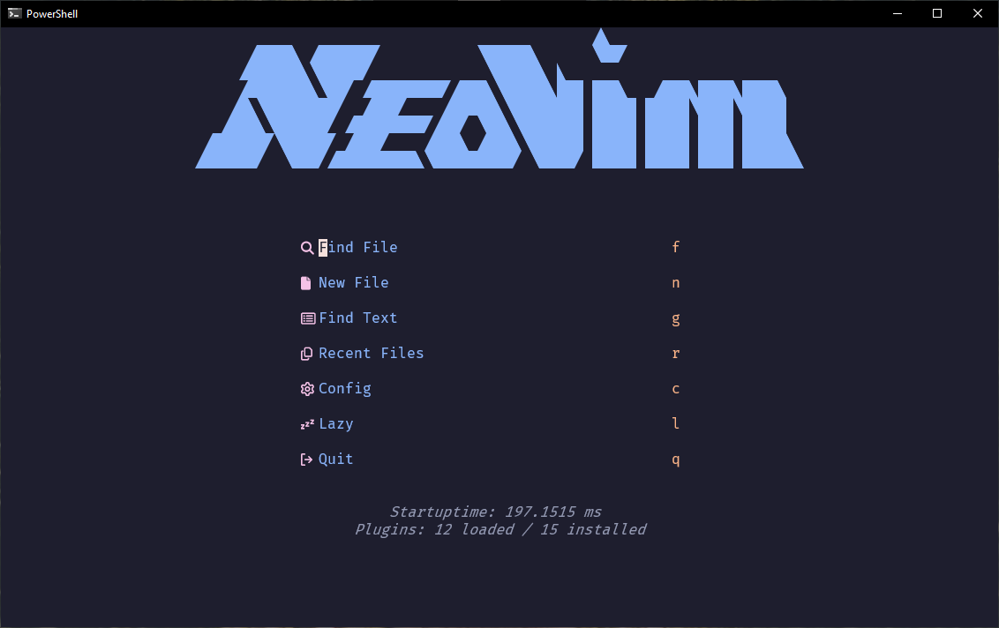
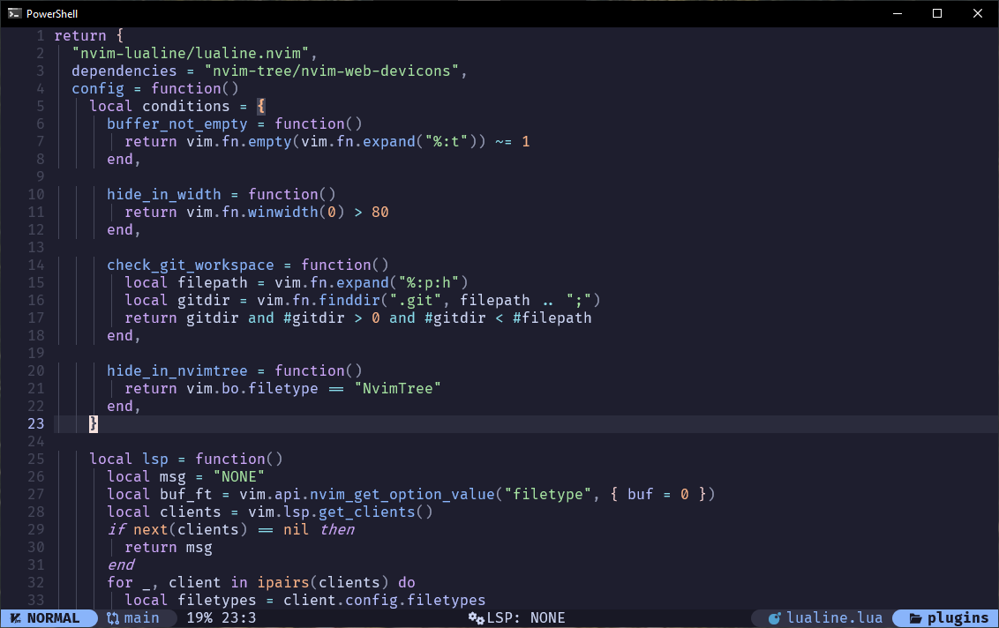
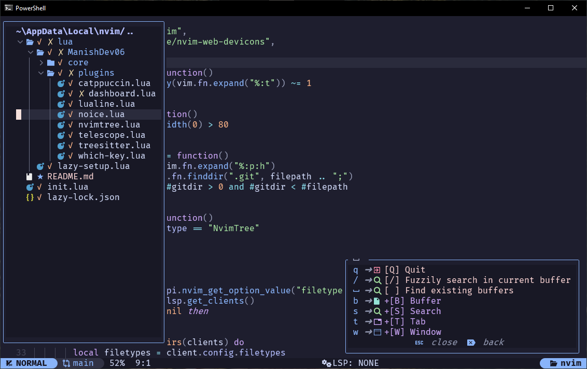

# ManishDev06 Neovim Setup 🌱

This is my personal Neovim setup,  this config provides a clean and asthetic interface.

## 📸 Screenshots

### Dashboard with Doom Theme


### Other Screenshots





## File Structure 🗂️
```plaintext
~\AppData\Local\nvim
  ✓ lua
    ✓ ManishDev06
  │   ✓ core
  │ │ │  ✓ autocmds.lua
  │ │ │  ✓ keymaps.lua
  │ │ │  ✓ options.lua
  │   ✓ plugins
  │   │  ✓ catppuccin.lua
  │   │  ✓ dashboard.lua
  │   │  ✓ lualine.lua
  │   │  ✓ noice.lua
  │   │  ✓ nvimtree.lua
  │   │  ✓ telescope.lua
  │   │  ✓ treesitter.lua
  │   │  ✓ which-key.lua
  │  ✓ lazy-setup.lua
   ✓ init.lua
   ✓ lazy-lock.json
```
## Features 🌟

- **Keymaps**: Custom keybindings for various tasks like resizing windows, navigating buffers, and managing tabs. ⌨️
- **Plugins**: A variety of plugins to enhance Neovim, including themes, file explorers, fuzzy finders, and statuslines. 🛠️
- **Options**: Optimized Neovim options for a smooth editing experience. 🧠
- **Lazy Loading**: Efficient plugin management with lazy loading to boost performance. 🏎️

## Installation 🛠️

1. Install [Neovim](https://github.com/neovim/neovim/blob/master/INSTALL.md). 💻
2. Clone this repository into your `~/.config/nvim` or in windows `~/AppData/Local/nvim` directory:
   ```bash
   git clone https://github.com/ManishDev06/nvim-config.git
   ```
3. Open Neovim and install plugins using your preferred plugin manager (e.g., `lazy.nvim`). 🔌

4. Once inside Neovim, plugins will be automatically installed and configured. 🛠️

## License 📝

This configuration is free to use and modify under the MIT license. Contributions are welcome! 💡
